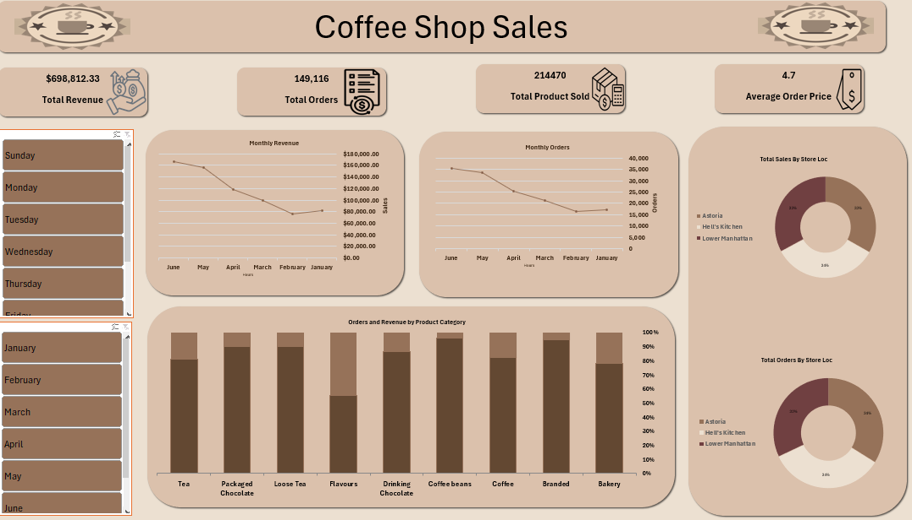

# ☕ Coffee Shop Sales Analysis

## 📌 Project Overview
This project analyzes **Coffee Shop Sales Data** using **Excel & Power Pivot**.  
It includes interactive dashboards to visualize sales performance, customer behavior, and product insights.  

The main objective of this project is to help decision-makers understand:
- Revenue trends
- Top-performing products
- Sales distribution by store, day, and size
- Customer purchasing patterns

---

## 📂 Files in Repository
- `Coffee Shop Sales_Dataset.xlsx` → Raw dataset used for analysis.  
- `Coffee_Shop_Sales_Final Project.xlsx` → Final project file including Power Pivot model and dashboards.  
- `Home.png` → Screenshot of the **Home Dashboard**.  
- `Product.png` → Screenshot of the **Product Dashboard**.  
- `Screenshot (1562).png` → Data model schema in Power Pivot.  
- `README.md` → Project documentation.  

---

## 🛠️ Tools & Technologies
- **Microsoft Excel**
- **Power Pivot**
- **Data Modeling (Star Schema)**
- **PivotTables & Charts**
- **Data Visualization (Dashboards)**

---

## 📊 Dashboards

### 🔹 Home Dashboard

**Key Metrics:**
- 💰 Total Revenue: `$698,812.33`  
- 🛒 Total Orders: `149,116`  
- 📦 Total Products Sold: `214,470`  
- 💵 Average Order Price: `4.7`  

**Visual Insights:**
- Monthly Revenue & Orders trend  
- Orders & Revenue by Product Category  
- Sales & Orders by Store Location  

---

### 🔹 Product Dashboard

**Key Insights:**
- Top 5 products by sales and orders  
- Bottom 5 products by sales and orders  
- Total sales by product size  
- Orders by day and hour  
- Quantity sold by size  

---

### 🔹 Data Model
.png)

**Star Schema Design:**
- **Fact Table** → Transactions (sales, orders, revenue)  
- **Dimension Tables** → Products, Stores, Dates  

Relationships are established between fact and dimension tables to enable efficient analysis.

---

## 📈 Business Insights
- **Peak Sales Hours:** 10 AM – 2 PM  
- **Top Products:** Barista Espresso, Brewed Tea, Hot Chocolate  
- **Slow Movers:** Sugar-Free Syrup, Organic Chocolate  
- **Best Store Location:** Lower Manhattan  

---

## 🚀 How to Use
1. Open `Coffee_Shop_Sales_Final Project.xlsx` in **Excel**.  
2. Enable **Power Pivot Add-in**.  
3. Explore dashboards & interact with slicers (Day, Month, Store, Product).  

---

## 📌 Author
👤 **Ziad Taha**  
📧 Contact: [Your Email]  
🔗 GitHub: [ziadtaha55](https://github.com/ziadtaha55)

---

⭐ If you like this project, don’t forget to **Star** the repository!

